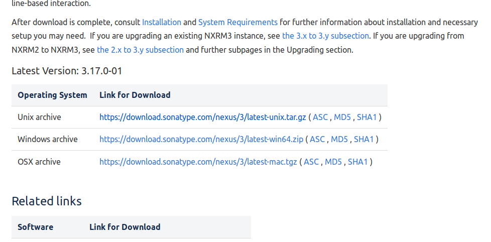
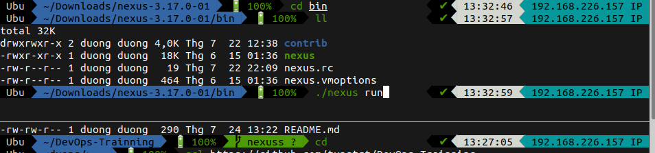
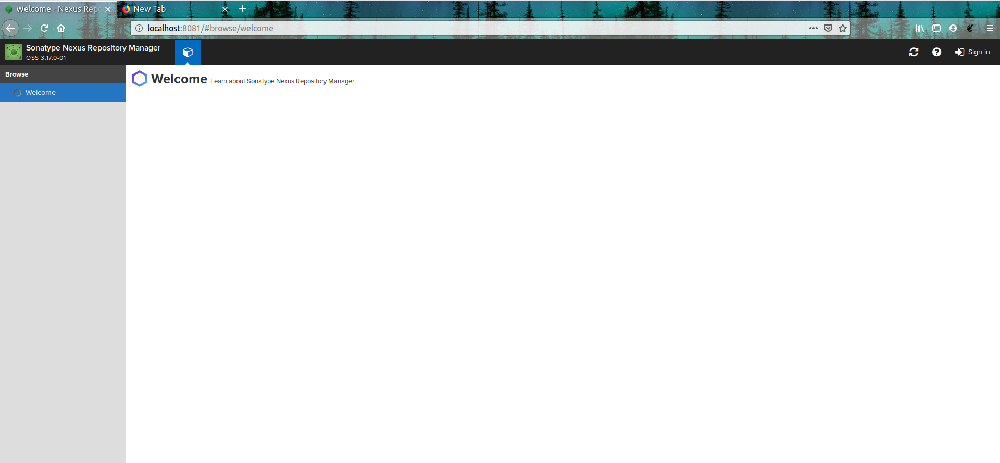
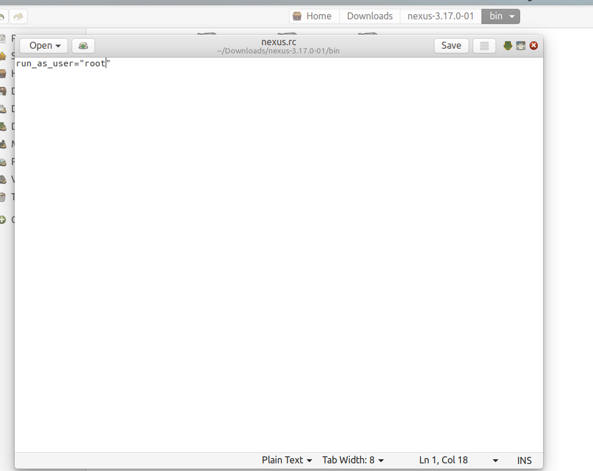
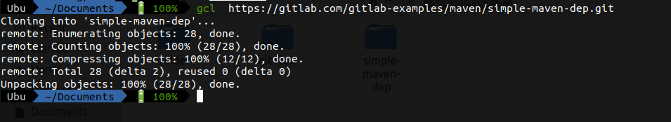
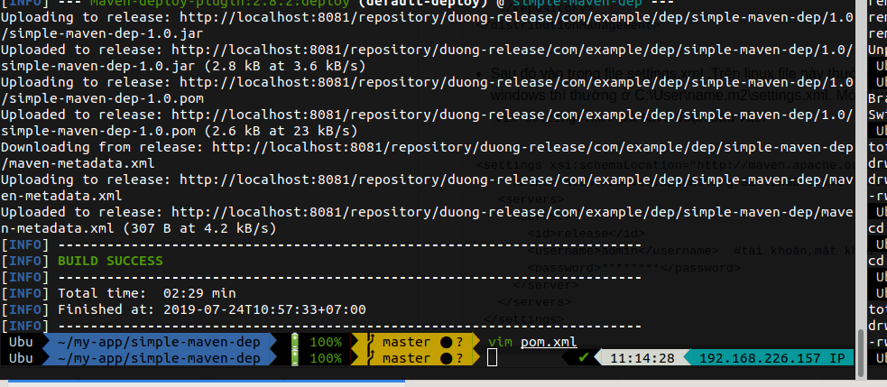
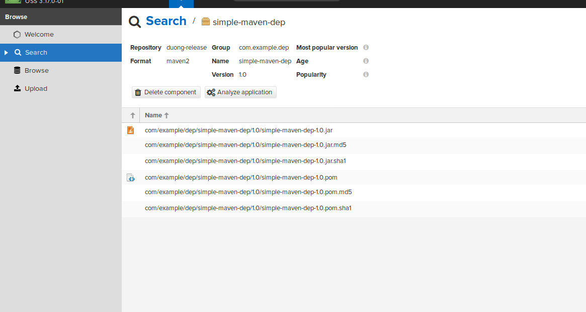

# Install Nexus and push artifactory to Nexus (Linux)
:sparkles::sparkles::sparkles::sparkles::sparkles::sparkles::sparkles::sparkles::sparkles::sparkles::sparkles::sparkles::sparkles::sparkles::sparkles::sparkles:
## Table of content
1. [What is nexus?](#define)
2. [Install](#install)
3. [Run as a service](#service)
4. [Type of repository on nexus](#type)
   - [Hosted repository](#hosted)
   - [Proxy repository](#proxy)
   - [Group repository](#group)
5. [Push artifactory to Nexus](#push)
<a name="define"></a>
## What is nexus :question:
- Nexus Repository Manager là công cụ để giúp ta tạo ra các repository để tiện cho việc quản lý các dependencies cho một dự án.
<a name="install"></a>
## Install :wrench:

- Đầu tiên vào trang [sonatype](https://help.sonatype.com/repomanager3/download) để tải nexus về 

- Sau đó giải nén vào một thư mục nào đó >> Vào thư mục đã giải nén >> /home/duong/Downloads/nexus-3.17.0-01/bin >> ./nexus run

- Sau khi chạy xong vào [localhost:8081](http://localhost:8081/) ta thấy giao diện như hình

- Sau đó ta phải đăng nhập bằng tài khoản admin để có thể tạo các repository trên nexus. Khi lần đầu bấm vào ***sign in*** ở góc phải màn hình sẽ hiện lên một bảng đăng nhập ở đây có ghi thông tin tài khoản admin và nơi chứa mật khẩu. Sau khi đăng nhập thì có thể đổi mật khẩu.
<a name="service"></a>
## Run as a service :running_man:
- Tạo một người dùng có đủ quyền để có thể chạy service trong file ***bin/nexus.rc*** ở đây e chọn root:
```run_as_user="root"``` thường thì đầu dòng có dấu # => uncomment nó.

- Sau đó symlink từ InstallDir/bin/nexus vào /etc/init.d/nexus: 
  - ```sudo ln -s /home/duong/Downloads/nexus-3.17.0-01/bin/nexus /etc/init.d/nexus```.
- Tạo một file tên nexus.service trong mục etc/systemd/system. Sau đó chèn đoạn script sau:
```[Unit]
Description=nexus service
After=network.target
  
[Service]
Type=forking
LimitNOFILE=65536
ExecStart=/home/duong/Downloads/nexus-3.17.0-01/bin/nexus start
ExecStop=/home/duong/Downloads/nexus-3.17.0-01/bin/nexus stop
User=root
Restart=on-abort
  
[Install]
WantedBy=multi-user.target
```

- Sau khi lưu lại chạy các lệnh: 
```
systemctl daemon-reload
systemctl enable nexus.service
systemctl start nexus.service
```

- Trong đó ***enable***  để service được khởi động cùng hệ thống, ***start*** để chạy service.
<a name="type"></a>
## Type of repository on nexus.
<a name="hosted"></a>
### Hosted repository
- Hosted repository là repository chứa những denpendencies thuộc về nội bộ không public ra ngoài. Khi một ai đó trong dự án cần và muốn sử dụng những dependencies này thì chỉ việc đẩy những dependencies này lên một hosted repository sau đó người nào cần thì chỉ việc request tới hosted repository này để tải những dependencies về 
- Cách tạo một hosted repository:
   - Setting >> Repository >> Repositories >> Create repository >> maven2 (hosted) >> Fill thông tin vào mẫu:
     - ***Name***: Tên của repository
     - ***If checked, the repository accepts incoming request:*** Cho phép disable or enable repo này
     - ***version policy:*** Có ba loại release, snapshot, mixed trong đó release là những dependencies được duyệt để sử dụng với một version nhất định. Còn snapshot là những version tạm thời. mixed là tập hợp cả release và snapshot.
     - ***Layout policy:*** Có tuân theo maven repo format hay không, strict là tuân thủ hoàn toàn, permissive là cho phép vi phạm 
     - ***Storage:*** default
     - ***Dependency:*** cho phép re-deploy, hay không hoặc chỉ cho phép readonly.
     - Tham khảo: [Maven Repository Format](https://help.sonatype.com/repomanager3/formats/maven-repositories)
<a name="proxy"></a>
### Proxy repository
- Đóng vai trò là proxy giúp ta có thể truy cập tới các repository bên ngoài. Để tránh cái việc download lại nhiều lần và nâng cao tốc độ download thông thường khi request đến proxy repository này maven repo sẽ check xem trên local đã có những dependencies ta cần đã có trên local chưa. Nếu chưa nó sẽ gửi request đến remote repository để tải những dependencies này về và save nó lại.
- Cách tạo một proxy repository: Tương tự hosted 
<a name="group"></a>
### Group repository
- Nơi ta có thể combine các repository khác nhau vào.
- Cách tạo một group repository: Tương tự hosted
<a name="push"></a>
## Push artifactory to Nexus
- Đầu tiên là cài đặt [maven trên ubuntu](https://www.vultr.com/docs/install-apache-maven-on-ubuntu-18-04)
- Sau đó clone một simple project trên gitlab về [simple code java](https://gitlab.com/gitlab-examples/maven/simple-maven-dep.git)

- Tạo một hosted repository trên nexus với version policy là release như sau còn khi nào release hay snapshot thì hình như ở chỗ version nếu có đuôi là -SNAPSHOT thì xài snapshot repository:
- Vào folder chứa project và thêm vào file pom như sau:
```
<distributionManagement>
   <repository>
     <id>release</id>
     <name>duong-release</name>
     <url>http://localhost:8081/repository/duong-release/</url>
   </repository>
</distributionManagement>
```
- Sau đó vào trong file settings.xml .Trên linux file này thường được đặt trong /home/user/.m2/settings.xml. Còn trên windows thì thường ở C:\User\name\.m2\settings.xml. Mới đầu khi vào folder .m2 ta sẽ không thấy file này chạy lệnh ```vim settings.xml``` và save đoạn sau vào:
```
<settings xsi:schemaLocation="http://maven.apache.org/SETTINGS/1.1.0 http://maven.apache.org/xsd/settings-1.1.0.xsd"
     xmlns="http://maven.apache.org/SETTINGS/1.1.0" xmlns:xsi="http://www.w3.org/2001/XMLSchema-instance">
   <servers>
     <server>
       <id>release</id>
       <username>admin</username>  #tài khoản,mật khẩu admin trên nexus
       <password>********</password>
     </server>
   </servers>
 </settings>
```
- Sau đó trở lại với folder project ta chạy lệnh ```mvn deploy``` cho kết quả như sau:



........Continue =>>>>>>> :notes: :notes: :notes: :notes: :notes: :notes: :notes: :notes: :notes:
