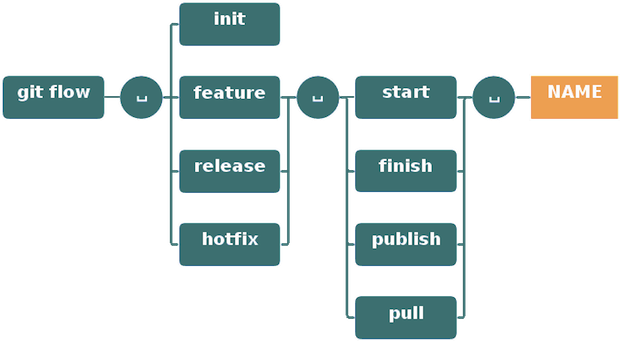

**Tìm hiểu về GitFlow và ứng dụng trong Development**

**I.	GitFlow**
-	Gitflow là một tool hay model do Vincent Driessen đề xuất ra => nhằm cải thiện quá trình làm việc cùng Git.
-	Thực chất của Git flow chỉ là việc chia nhánh và merge nhánh vào một tập hợp các tính năng hoặc fix => dễ dàng quản ý các nhánh và việc merge.

*Các branch chính trong GitFlow*
      
      Master branch: Là branch được tạo mới repository và tạo mặc định tron Git. Không commit trực tiếp vào master mà chỉ dung để merge.
      
      Develop branch: Là branch chính dùng cho việc phát triển sản phẩm. Từ develop sẽ ngắt ra nhiều các branch feature khsac nhau, nên đặt tên các branch sao cho có thể dễ dàng thấy được nôi dung của từng feature
      
      Release branch: Dùng để release sảm phẩm. Khi sản phẩm release, có rất nhiều những feature khác nhau được lấy ra từ branch develop. Sau khi release xong, chúng lại được merge trở lại nhánh trước đó và ghi release tag vào commit của branch đó >> sau đó nó được xóa đi
      
      Hotfix branch: giông với release, chúng được lấy ra từ branch develop/master để fix sau đó merge trở lại với tag hotfix được ghi vài commit >> sau đó nó được xóa đi

**II.	GitFlow trong Development**

Với 1 team làm việc thông thường, Leader sẽ update 1 branch master với các commit mới nhất. Các developer thực hiện checkout master này để là việc (có thể là fix hoặc feature). Sau đó Leader review và cherry-pick các commit vào branch master.

>>> vấn đề xảy ra ở đây là việc conflict hay merge code gặp trục trặc sẽ thường xuyên xảy ra, nhất là khi có hotfix > làm cho việc quản lý rối rắm hơn >> vậy nên GitFlow ra đời.
GitFlow đưa ra các quy ước để có thể giúp leader quản lý dễ dàng hơn. Ý tưởng dựa trên việc duy trì các branch cố định trong suốt quá trình phát triển sản phẩm. Branch master luôn là branch chính áp dụng cho production, trong khi các branch hotfix, features hay develop chỉ để phục vụ cho quá trình testing của QA =>>> hoàn thiện mới đẩy lên master. Cụ thể được áp dụng và với cấu trúc lệnh như sau:

-	Lead sẽ đẩy lên branch master ban đầu.

        Tạo repo: git flow int

-	Từ master, dev sẽ check out 1 branch phục vụ cho các nhu cầu khác nhau (fix/hotfix/feature)

        git flow feature start (tên branch)
        
-	Tiến hành release 1 tính năng

        git flow release start/finish/publish (tên branch)
        
-	Sau khi hoàn thành, có thể kết thúc tính năng đó, sử dụng lệnh:

        git flow feature finish (tên branch)
        
Câu lệnh sẽ thực hiện các thao tác: merge tính năng vào nhánh develop, xóa tính năng, chuyển sang nhánh develop.
-	Công bố tính năng: 

        git flow feature publish (tên branch)
        
-	Sau khi hoàn thành tính năng và sẵn sàng cho việc test, developer sẽ tạo pull-request để yêu cầu xác nhận  > > team lead review và feedback.
-	Develop sẽ thực hiện fix nếu cần thiết, sau đó sẽ deploy và test toàn bộ công việc vừa làm trên staging.
-	Sauk hi hoàn thành test trên staging, sẽ chuyển qua gửi yêu cầu merge-reuqest lên production (nhánh master).

