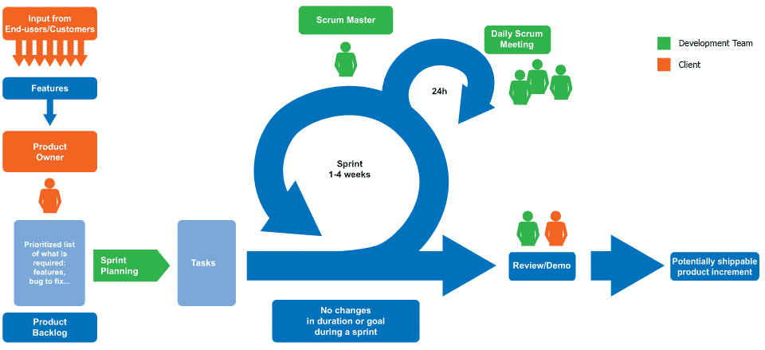
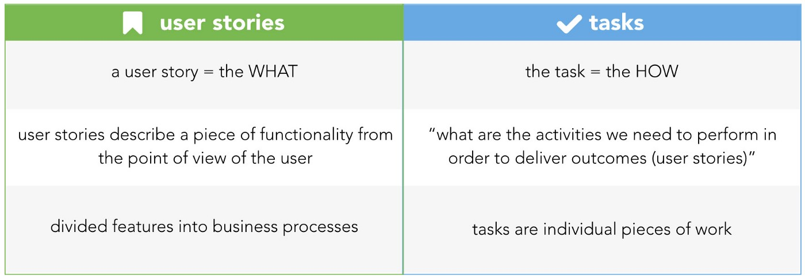
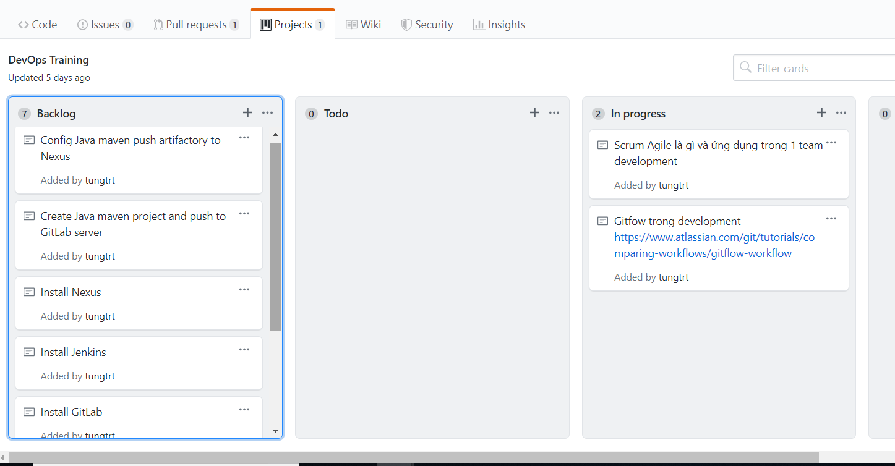

**Tìm hiểu về Scrum/Agile và ứng dụng trong team Develop**

**I.	Giới thiệu về Agile/Scrum**
1.	Phương pháp Agile
-	Là một phương pháp phát triển phần mềm linh hoạt để làm sao đưa sản phẩm tới tay người dùng càng sớm càng tốt.
-	Tuyên ngôn Agile: còn được gọi là “Tuyên ngôn Phát triển phần mềm linh hoạt”, đưa ra các giá trị cốt lõi nhất mà toàn bộ các nhà lý thuyết cũng như những người thực hành Agile tuân thủ. Trong đó đánh giá cao đến việc:

*Cá nhân và sự tương tác hơn là quy trình và công cụ;*

*Phần mềm chạy tốt hơn là quy trình;*

*Cộng tác với khách hàng hơn là đàm phán hợp đồng;*

*Phản hồi với các thay đổi hơn là bám sát kế hoạch;*

Ngoài tuyên ngôn, Agile còn có 12 nguyên lý giúp gợi ý cho những người phát triển phần mềm vận dụng Agile vào thực tế ( 12 nguyên lý này e không list vào a nhé, dài quá, đọc hiểu ok là được).
-	Đặc trưng của Agile:
+ Tính lặp (Iterative/Sprint): Dự án sẽ được thực hiện trong các phân đoạn lặp đi lặp lại. Và thường kéo dài từ 1-4 tuần. Trong mỗi giai đoạn này, nhóm phát triên thực hiện đầy đủ các công việc cần thiết như: lập kế hoạch, phân tích yêu cầu, thiết kế, triển khai, kiểm thử để đưa ra những phần của sản phẩm. => phân mục tiêu thành các phần nhỏ và không thực hiện lập kế hoạch dài hạn.
+ Tính tiến hóa (Evolutionary): Sau mỗi phân đoạn, các phần nhỏ của sản phẩm được tích lũy, lớn dần lên cho tới khi toàn bộ yêu cầu của khách hàng được thỏa mãn.
+ Tính thích nghi (daptive): Do các phân đoạn chỉ kéo dài trong thời gian ngắn, việc lập kế hoạch cũng được điều chỉnh liên tục => các thay đổi trong quá trình phát triển (như yêu cầu thay đổi, thay đổi công nghê ,..) cũng đều được đáp ứng theo cách thích hợp.
2.	Scrum
 
 
 
-	Là một quy trình phát triển phần mềm theo phương pháp Agile, tuân theo các nguyên tắc của Agile Manifesto.
-	Ngoài ra Scrum hoạt động dựa trên 3 giá trị cốt lõi:
    Minh bạch: các thông tin trong quá trình phát triển phải được minh bạch và thông suốt.
    Thanh tra: để đảm bảo các vấn đề được tìm thấy và giải pháp phải đưa ra kịp thời. 
    Thích nghi : đảm bảo các sản phẩm phù hợp với yêu cầu của người dùng

**II.	Scrum team**
-	Product Owner ( PO ) : Người chịu trách nhiệm về sản phẩm, cũng là người hiểu rõ nhất về sản phẩm đang được phát triển. Thông thường PO sẽ là khách hàng, nếu khách hàng là những end user không hiểu rõ về technical thì người này thường là BA hoặc bên thứ 3 do khách hàng thuê. Nhiệm vụ chính của PO là : 
    Phát triển và quản lý User story, Backlog
    Sắp xếp thứ tự các Backlog được làm trong từng sprint đảm bảo tính logic, và khối lượng User Story Point cho từng Sprint 
    Mô tả rõ ràng, truyền đạt lại cho Dev team và trả lời các Q&A 
    Giám sát tính hoàn thiện của sản phẩm 
-	Scrum Master : Người nắm rõ nhất về quy trình phát triển sản phẩm theo mô hình Scrum có trách nhiệm : 
    Hướng dẫn các member thực hiện đầy đủ các event của từng sprint, cách sử dụng các scrum tool
    Làm việc với các stake holder để cung cấp các Configuration Item cần thiết cho Dev team hoặc xử lý các issue 
    Quản lý communication giữa Dev team, PO và các bên liên quan
-	Dev team : Là nhóm phát triển sản phẩm, bao gồm cả Dev ( front end, back end, mobile… ) và tester. Thường sẽ có từ 3-6 người có trách nhiệm :
    Nhận Sprint Backlog từ PO vào đầu mỗi sprint, study và clear toàn bộ các Q&A
    Báo cáo kết quả công việc hàng ngày, cũng như các issue gặp phải để các bên kịp thời xử lý. 

**III.	Artifacts**
1.	User story  
Đây là các yêu cầu đầu vào từ Khách hàng để xác định các tính năng của sản phẩm dưới dạng mô tả người dùng ( non technical ), từ User story thì PO có thể define ra được các backlog.

2.	User story point
Là  đại lượng chỉ độ lớn của 1 user story trong cùng 1 dự án. Nó là 1 đơn vị cố định ( tại dự án đó ) và việc đánh giá số point của 1 user story sẽ dựa trên phương pháp ước lượng linh hoạt ( Agile Estimation ) mà phổ biến nhất là cách thức chơi Scrum Poker.

3.	Product Backlog 
Từ User story, PO sẽ xác định được danh sách các công việc mà team cần phải làm để hoàn thiện sản phẩm. Danh sách công việc này chính là Product backlog. 
Product backlog sẽ không cố định và thường xuyên thay đổi qua mỗi sprint, tùy theo yêu cầu thay đổi từ phía khách hàng

4.	Sprint backlog
Danh sách công việc thực hiện cho từng sprint được team chọn ra trong buổi planning đầu mỗi sprint.

5.	Increment
Các backlog mà team đã hoàn thành. Phần dã thực hiện được sẽ lớn dần sau mỗi sprint, và hoàn thiện khi dự án kết thúc.

6.	Velocity
Là số story point mà team thực hiện được trong 1 sprint.
Velocity có thể thay đổi theo thời gian, thông thường là tăng.
Dùng để hoạch định sản phẩm và kế hoạch về thời gian phát hành. 

**IV.	Event**
1.	Sprint Planning 
Cuộc họp đầu dự án. PO sẽ truyền đạt lại các backlog sẽ được thực hiện trong sprint này, team sẽ tự estimate theo khả năng của bản thân để nhận công việc và xác định thời gian hoàn thành. 

2.	Daily meeting
Cuộc họp ngắn hàng ngày tại 1 thời gian cố định ( được team thống nhất từ đầu dự án ), được sử dụng hiệu quả trong việc tracking tiến độ thực hiện các backlog. Nội dung báo cáo bao gồm :
-	Hôm qua bạn đã làm gì ?
-	Hôm nay bạn sẽ làm gì ?
-	Bạn có gặp vấn đề gì không ?

3.	Demo meeting
Team sẽ trình bày về những sản phẩm đã làm được trong sprint này. 
Những backlog chưa được thực hiện sẽ gửi lại báo cáo cho PO, PO sẽ sắp xếp các backlog này được thực hiện lúc nào ( có thể là sprint sau hoặc sau sprint cuối cùng )

4.	Sprint Review
Sau khi demo xong, team sẽ đánh giá lại khối lượng point đã thực hiện trong sprint vừa rồi để lên kế hoạch thực hiện point cho sprint tiếp theo

5.	Retrospective
Diễn ra sau sprint review
Mỗi 1 thành viên sẽ được phát 3 tờ giấy khác màu, tương ứng với các nội dung : Good, not good và action. Đây là phương pháp để các member self review, tự improve qua mỗi sprint và cũng là để sharing các lesson cho nhau. 

**V.	Example**

PO: Tungtt
SM: Tungtt nốt
Dev team: Nhaivt và Duongdx
-	User story: Tôi là Tungtt, tôi muốn training DevOps cho 2 bạn Nhaivt và Duongdx
-	Trong buổi họp đầu dự án, a Tungtt sẽ phân tích user story và đưa ra các tính năng cần thực hiện để hoàn thành sản phẩm vào backlog. (Cụ thể các task đã list trong backlog e không ghi lại ở đây nữa nhớ)
-	Trong buổi họp trước mỗi sprint, a Tungtt sẽ quyết định đưa những task nào vào thực hiện, và estimate thời gian hoàn thành các công việc. (tạm thời ví dụ có 2 task đưa vào sprint 1 đó là: tìm hiểu về Agile/Scrum và ứng dụng trong team develop; GitFlow trong development
-	Tem dev ( cụ thể là Nhaivt và Duongdv) sẽ thực hiện các task được đưa ra, sau đó sẽ được review bởi anh Tungtt ( PO của dự án). Anh Tungtt sẽ là người quyết định các task có đạt với yêu cầu đề ra hay không, và đưa ra các phương án nếu không được chấp thuận.
-	Sau mỗi sprint, cả team sẽ ngồi lại với nhau để review/đánh giá…
>>>>	Các sprint sẽ diễn ra liên tục cho tới khi dự án được hoàn thành
