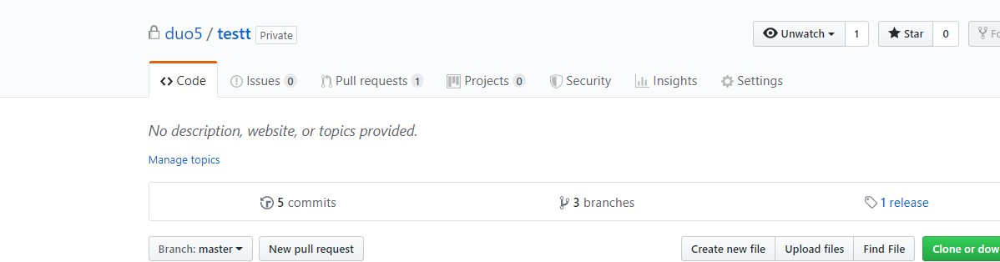
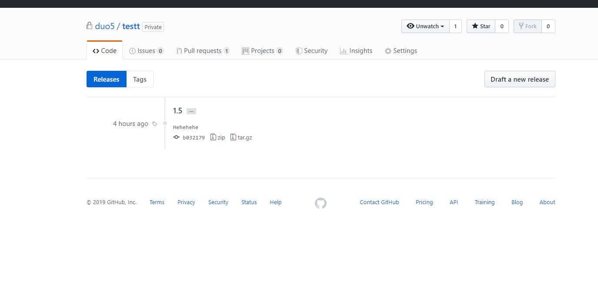

# GIT-FLOW :sunglasses: :sunglasses: :sunglasses: :sunglasses:


## Git branching.
- Vấn đề đặt ra là khi ta làm việc trên master và muốn release một phiên bản của production và ta vẫn muốn các công việc hay việc phát triển các tính năng cho lần release sau đảm bảo vẫn diễn ra song song giải pháp lúc này là sử dụng git branching.
Là kỹ thuật phân nhánh, đó là việc phân nhánh trong working tree ta đang làm việc.

### branch meaning
Gồm hai nhánh chính đó là:
- ***Master***: 
  - Nơi phản ánh trạng thái đã sẵn sàng deploy lên production.
- ***Develop***: 
  - Là nơi mà diễn ra toàn bộ quá trình phát triển. Khi mà source code đã đạt một độ ổn định nhất định và sẵn sàng release thì sẽ tạo ra một nhánh là release từ nhánh develop và nhánh release này chỉ được phép fix bug. Sau đó sẽ được merge trở lại nhánh develop và nhánh master được đánh dấu với một tag release version.
  
Bên cạnh đó cũng bao gồm các nhánh phụ base trên các nhánh chính để giúp các thành viên trong team có thể phát triển cùng lúc, theo dõi theo feature, chuản bị để release và sửa các lỗi trong giai đoạn production như:

- ***Feature***: 
  - Khi cần phát triển một tính năng nào đó ta sẽ tạo ra một nhánh feature từ nhánh develop để tiến hành phát triển tính năng đó trên nhánh này.Phải đảm bảo rebase để áp dụng những commit mới nhất từ branch develop để khi hoàn thành tính năng này và merge vào không bị conlict.
- ***Release***:
  - Khi cần chuẩn bị để release một phiên bản production mới ta sẽ tạo ra một nhánh release này. Hoàn thành các công việc cuối cùng trc khi release trên nhánh này và fix các bug nhưng không thể code thêm tính năng mới trên nhánh này. Khi đã tách riêng 1 nhánh này ra khỏi nhánh develop thì ta hoàn toàn có thể phát triển tiếp các tính năng cho đợt release tiếp theo.
  - Điều kiện để tạo một nhánh release là khi mà nhánh develop đã đạt được trạng thái (điều kiện) thỏa mãn như các tính năng cần thiết đã đạt yêu cầu và đã được merge vào đầy đủ. Còn các feature khác là điều kiện cho các lần release sau phải đợi sau khi tạo nhánh release này xong mới được merge vào. 
  - Cuối cùng là sau khi đã thực hiện xong các bước chuẩn bị để release bản production ta tiến hành merge nhánh này vào develop và sau đó là master với tag release number.
  - Khi đủ điều kiện để tạo một bản release đầu tiên ta sẽ tạo một nhánh release:
  ```
  git checkout -b release-1.5 develop
  ./release.sh 1.5
  git commit -am 'Increamenting vervion number to 1.5'
  ```
  - Trong đó release.sh là một script tượng trưng cho việc thay đổi một số file trong source để biểu thị phiên bản mới. Sau đó ta sẽ tiến hành commit thao tác này. 
  - Sau khi thực hiện xong việc fix bug để tiến hành release, mọi thứ đã sẵn sàng thì đầu tiên ta merge release vào master và gắn tag number vào commit merge để có thể dễ dàng tham chiếu:
  ```
  git checkout master
  git merge --no-ff release-1.5
  git tag -a 1.5 -m 'Release version-1.5'
  ```
  - Sau đó tiến hành merge vào develop.
  ```
  git checkout develop
  git merge --no-ff release-1.2
  ```
  - Việc release đã hoàn thành lúc này ta đã có thể xóa nhánh này đi.
  - Về cách quản lý các bản release:
  - Chuyển về nhánh master gõ lênh: ```git tag``` lúc này ta sẽ thấy danh sách các tag có trong dự án:
  ```
  duong@DESKTOP-F31ICUI MINGW64 ~/testt (master)
  $ git tag
  1.5
  ```
  - Mặc định lệnh ```git push``` sẽ không đẩy tag lên remote repository mà ta phải dùng lệnh ```git push --tags``` để đẩy toàn bộ lên remote repository hoặc đẩy một tag chỉ định lên ```git push tag_number```
  - Lên trên github lúc này sẽ thấy tag xuất hiện ở trên repository. Bấm vào thẻ release trên github ta sẽ thấy giao diện quản lý các bản release như sau:
  
  
- ***Hotfix***:
  - Hotfix khá giống release đều prepare cho việc release production chỉ là một cái là có plan và một cái hotfix là k có plan cụ thể đó là việc trên bản production xảy ra một lỗi nào đó lúc này ta phải tạo ngay một nhánh là hotfix được đánh version (khi tạo nhánh hot fix mới tiến hành update tag release ver) cho dễ nhận biết và tiến hành sửa lỗi. Nhờ đó một số bộ phận sẽ tiến hành fix bug trên nhánh này một số khác vẫn tiến hành làm việc trên develop bình thường.
  - Sau đó khi kết thúc việc sửa lỗi tiến hành merge vào master và tất nhiên là cả develop để tránh việc code chạy lỗi, nếu vẫn còn tồn tại nhánh release thì merver vào nhánh release này vì cuối cùng nhánh release cũng sẽ merge vào develop ngoại trừ việc nhánh develop này cần fix ngay bug xảy ra trên production.
## Gitflow là gì :question:
- Git flow được đưa ra nhằm cải thiện quá trình làm việc cùng git. 
- Là một tool đơn giản để quản lý git branches. 
- Đơn giản là việc chia ra nhiều nhánh như (master,develop,hotfix,release,support) làm việc trên nhánh đó.
- Để tiện cho việc quản lý các branch tránh các vấn đề merge.

## Cách thức làm việc với các lệnh sử dụng git-flow extension :exclamation:
  - Thực ra không cần dùng đến git-flow extension mà ta hoàn toàn có thể chạy bằng các câu lệnh git bình thường, việc sử dụng git-flow extension thực ra chỉ giúp ta rút ngắn vài dòng lệnh. Em thấy nếu hiểu rồi thì có thể dùng git-flow extension để cho hiệu quả nếu không nên sử dụng các lệnh git bình thường để hiểu vấn đề.

  - Đầu tiên để sử dụng git-flow ta khởi tạo nó trong một git repository đã có:
  ***git flow init***.
  
  - 
  - Quá trình code thường xảy ra trên nhánh develop. Tuy nhiên trong quá trình đó giả sử phải làm thêm một tính năng nào đó như là add to cart thì lúc đó sẽ phải tạo ra một nhánh mới là feature/ADDTOCART dựa trên nhánh develop đó rồi sau đó chuyển sang nhánh này: ***git flow feature start ADDTOCART***.
  
  - Sau khi ta hoàn thiện tính năng addtocart ta lại merge nhánh feature đó vào nhánh develop, sau đó chuyển sang nhánh develop và xóa nhánh feature đó đi: ***git flow feature finish ADDTOCART***.
  
  - Khi muốn công bố tính năng cho mọi người trên remote repository (github) sử dụng ***git flow feature publish ADDTOCART*** để push nhánh đó lên github.
  
  - Khi muốn pull những tính năng đó về local repository t dùng lệnh ***git flow feature pull *REMOTE_REPO* ADDTOCART***. 
  
  - Tương tự khi muốn tạo một nhánh release để tiến hành chuẩn bị cho việc release một bản production.
  - Các lệnh :
  - ***git flow release start [Release ver]***.
  - ***git flow release finish [Release ver]***. kết thúc release và merge vào master và develop
  - ***git flow release publish [Release ver]***.
  - Lúc này khi mà trên production xảy ra lỗi thì lúc này ta sẽ tạo ngay một nhánh hotfix để tiến hành sửa các lỗi. Sau khi hotfix xong ta sẽ lại merge vào master và develop tương tự như release.
  - Các lệnh :
  - ***git flow hotfix start version base_name***. base_name sẽ chỉ định base trên nhánh nào?
  - ***git flow hotfix finish version***.
  - 
  
  ====================================END=====================================
