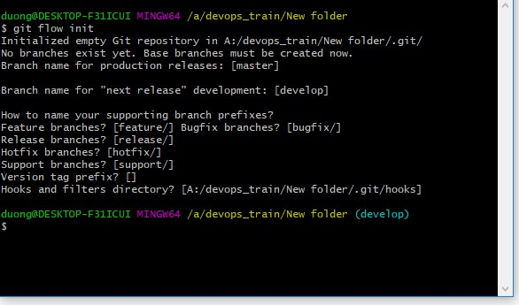

# GIT-FLOW :sunglasses: :sunglasses: :sunglasses: :sunglasses:

## Gitflow là gì :question:
- Git flow được đưa ra nhằm cải thiện quá trình làm việc cùng git. 
- Đơn giản là việc chia ra nhiều nhánh như (master,develop,hotfix,release,support) làm việc trên nhánh đó.
- Để tiện cho việc quản lý các branch tránh các vấn đề merge.

## Cách thức làm việc với các lệnh sử dụng git-flow extension :exclamation:
  - Thực ra không cần dùng đến git-flow extension mà ta hoàn toàn có thể chạy bằng các câu lệnh git bình thường, việc sử dụng git-flow extension thực ra chỉ giúp ta rút ngắn vài dòng lệnh. Em thấy nếu hiểu rồi thì có thể dùng git-flow extension để cho hiệu quả nếu không nên sử dụng các lệnh git bình thường để hiểu vấn đề.

  - Đầu tiên để sử dụng git-flow ta khởi tạo nó trong một git repository đã có:
  ***git flow init***.
  

  - Quá trình code thường xảy ra trên nhánh develop. Tuy nhiên trong quá trình đó giả sử phải làm thêm một tính năng nào đó như là add to cart thì lúc đó sẽ phải tạo ra một nhánh mới là feature/ADDTOCART dựa trên nhánh develop đó rồi sau đó chuyển sang nhánh này: ***git flow feature start ADDTOCART***.
  
  - Sau khi ta hoàn thiện tính năng addtocart ta lại merge nhánh feature đó vào nhánh develop, sau đó chuyển sang nhánh develop và xóa nhánh feature đó đi: ***git flow feature finish ADDTOCART***.
  
  - Khi muốn công bố tính năng cho mọi người trên remote repository (github) sử dụng ***git flow feature publish ADDTOCART*** để push nhánh đó lên github.
  
  - Khi muốn pull những tính năng đó về local repository t dùng lệnh ***git flow feature pull *REMOTE_REPO* ADDTOCART***. 
  
  - Sau khi việc code trên nhánh develop hoàn tất thông thường ngta sẽ tạo luôn một nhánh release và checkout code từ nhánh develop vào release kiểm tra các kiểu xem còn lỗi gì không. Nếu còn lỗi thì sẽ gọi một số đứa vào để fix và làm trên nhánh này luôn. Khi mọi thứ xong ta sẽ merge nhánh release này vào master và cả develop.
  - Các lệnh :
  - ***git flow release start [Release ver]***.
  - ***git flow release finish [Release ver]***.
  - ***git flow release publish [Release ver]***.
  - Có thể do 1 vài trường hợp nào đó mà sẽ release trên nhánh master nếu trên nhánh master xảy ra lỗi thì lúc này ta sẽ tạo ngay một nhánh hotfix để tiến hành sửa các lỗi. Sau khi hotfix xong ta sẽ lại merge vào master và develop tương tự như release.
  - Các lệnh :
  - ***git flow hotfix start version base_name*** base_name sẽ chỉ định base trên nhánh nào?
  - ***git flow hotfix finish version***.
  
  
  ====================================END=====================================
