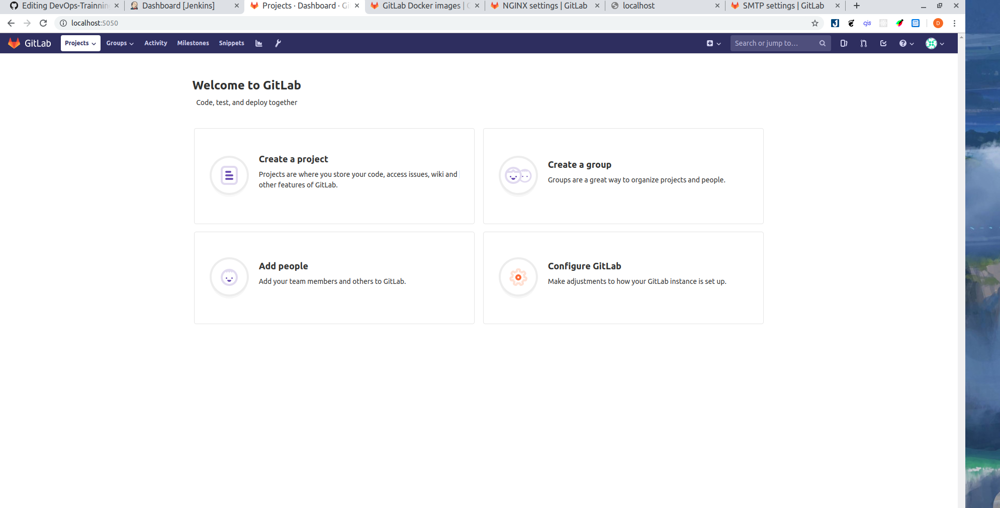

# Install gitlab via docker.

- Đầu tiên là cài đặt [docker trên ubuntu](https://www.digitalocean.com/community/tutorials/how-to-install-and-use-docker-on-ubuntu-18-04)

- Sau khi cài xong docker chạy lệnh:
```
sudo docker run --detach \
  --hostname gitlab.example.com \
  --publish 443:443 --publish 80:80 --publish 22:22 \
  --name gitlab \
  --restart always \
  --volume /srv/gitlab/config:/etc/gitlab \
  --volume /srv/gitlab/logs:/var/log/gitlab \
  --volume /srv/gitlab/data:/var/opt/gitlab \
  gitlab/gitlab-ce:latest
```

- Khi chạy lệnh này docker sẽ tự tìm image có tên là gitlab/gitlab-ce:lastest và tự động tải về trong đó:
  - ***--detach*** nghĩa là chạy container trong background và in container ID.
  - ***--hostname*** container host name.
  - ***--name*** tên của container.
  - ***--publish*** publish các port cần thiết của container tới host để có thể truy cập qua ssh,http,https.
  - ***--restart*** container sẽ tự động restart khi system reboot.
  - ***--volume*** gán volume tới container ở đây dữ liệu được lưu trữ tại các thư mục con của /srv/gitlab/
- Sau khi chạy xong vào localhost:80 có thể sẽ phải đợi một lúc. Nếu như quá trình cài đặt quá lâu chạy lệnh ```sudo docker logs -f gitlab``` để theo dõi tiến trình chạy.
- Có thể trong quá trình chạy bị lỗi permission nên việc chạy câu lệnh trên để kiểm tra là cần thiết. Khi đó để fix vấn đề về permission ta chạy lệnh:
  - ```sudo docker exec gitlab update-permissions```
  - ```sudo docker restart gitlab```
- Mọi config của gitlab đều ở trong /etc/gitlab/gitlab.rb tại đây ta có thể set external_url, để nhận mail từ gitlab config ***smtp settings*** vì gitlab image không cài đặt SMTP server . Để truy cập vào config file này start một shell session của một container đang chạy và tiến hành sửa đổi trong file gitlab.rb:
- ```sudo docker exec -it gitlab /bin/bash```.
- Sau khi đã config xong ta sẽ restart lại container để reconfigure gitlab ```sudo docker restart gitlab```.
- Khi lần đầu truy cập vào gitlab, sẽ có một bảng để đặt admin password. Sau khi đặt mật khẩu ta hoàn toàn có thể đăng nhập vào tài khoản ***root*** và password vừa tạo.

- result: 

