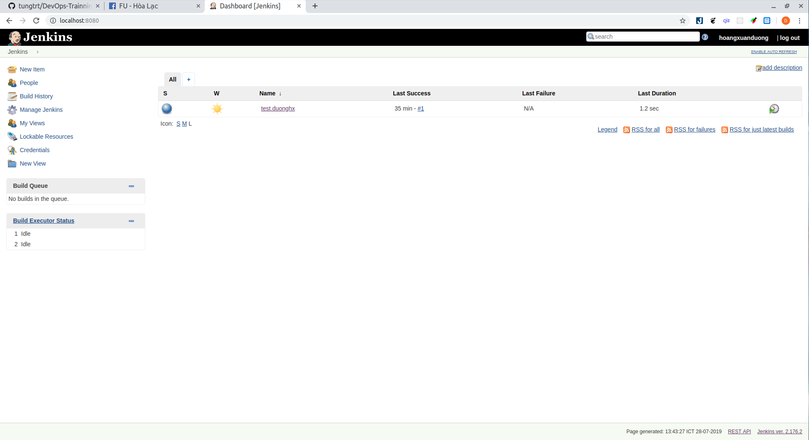

# Install Jenkins.

## Install
- Đầu tiên sử dụng Debian package repository của jenkins để tự động install và update:
```
wget -q -O - https://pkg.jenkins.io/debian-stable/jenkins.io.key | sudo apt-key add -
```

- Sau đó thêm đoạn ```deb https://pkg.jenkins.io/debian-stable binary/``` vào /etc/apt/sources.list.d/jenkins.list để thêm jenkins repo vào hệ thống:
```
sudo sh -c 'echo deb http://pkg.jenkins.io/debian-stable binary/ > /etc/apt/sources.list.d/jenkins.list'
```

- Sau đó tiến hành update apt package list và install jenkins.
```
sudo apt update
sudo apt install jenkins
```
- Sau khi cài đặt xong jenkins service sẽ tự động start, lúc này để xem status của nó ta gõ:
```
systemctl status jenkins
```
- Để jenkins tư động chạy khi bật máy t gõ:
```
systemctl enable jenkins
```
- Để dừng jenkins:
```
systemctl stop jenkins
```
## Setting up
- Mở trình duyệt gõ địa chỉ ip của máy hoặc localhost:8080 sẽ hiện một bảng unlock jenkins tại đây ta sẽ biết được nơi chưa Administrator password.
- Mở file đó lên ```sudo cat /var/lib/jenkins/secrets/initialAdminPassword``` rồi điền mật khẩu vào ô Administrator password.
- Sau đó sẽ hiện một bảng customize jenkins có thể chọn cài đặt những suggest plugins hoặc chọn một số plugin để cài đặt.
- Sau khi cài đặt plugin xong tiến hành tạo một user admin >> Save and Continue.
- Sau đó sẽ hiện lên một bảng để set URL cho jenkins sau khi fill xong Save and Finish để hoàn tất cài đặt.

